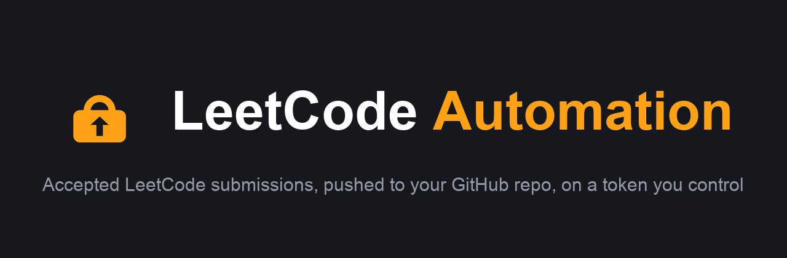

  

# LeetCode Automation

A Chrome extension that pushes every accepted LeetCode submission to one GitHub repo the moment you pass all tests. It is a hardened fork of [LeetHub-3.0](https://github.com/raphaelheinz/LeetHub-3.0) by Raphael Heinz (MIT).

## What changed from upstream, and why

| Upstream LeetHub-3.0 | LeetCode Automation |
| --- | --- |
| GitHub OAuth with the `repo` scope: full read/write on **every** repo you own | You paste a **fine-grained token** limited to **one** repo |
| OAuth client secret shipped inside the extension | No OAuth code at all |
| Content scripts also run on `github.com` | Runs only on `leetcode.com` and `leetcode.cn` |
| Loads Semantic UI CSS from a CDN at runtime | All CSS and fonts vendored locally, nothing loaded from the internet |
| No CSP limits on network calls from extension pages | CSP `connect-src` locked to `api.github.com` |
| Auto-updates from the Chrome Web Store | You load the code you reviewed; nothing changes unless you pull it |

The token is stored in `chrome.storage.local` and is only ever sent to `api.github.com`. There is no backend, no analytics, no telemetry.

## Setup

### 1. Create a fine-grained GitHub token

1. GitHub → Settings → Developer settings → Personal access tokens → **Fine-grained tokens** → Generate new token.
2. Token name: `leetcode-automation`.
3. Expiration: pick the longest you're comfortable with. You'll paste a new one when it expires.
4. Repository access: **Only select repositories** → pick your LeetCode repo (create an empty one first if needed).
5. Repository permissions: **Contents → Read and write**. Leave everything else at No access. (Metadata read is added automatically.)
6. Generate, then copy the token. It starts with `github_pat_`.

### 2. Load the extension

1. Clone this repo.
2. Open `chrome://extensions`, turn on **Developer mode** (top right).
3. Click **Load unpacked** and pick the cloned folder.

### 3. Connect

1. Click the LeetCode Automation icon in the toolbar, paste the token, click **Save token**.
2. A welcome tab opens. Choose **Link an Existing Repository**, pick your LeetCode repo, click **Get Started**.
3. Solve a problem on LeetCode. On Accepted, wait about four seconds for the spinner in the toolbar to finish. The file is now in your repo.

To disconnect, click the red sign-out icon in the popup. That wipes the token and repo link from the browser. Also revoke the token on GitHub if you no longer need it.

## File layout in your repo

Default: `0217-contains-duplicate/0217-contains-duplicate.py` plus a `README.md` with the problem statement. The popup has toggles for difficulty subfolders, language subfolders, timestamped filenames, and auto-committing solution posts.

## Reviewing the code yourself

The parts that touch your token are small:

- `src/js/popup.js`: validates the pasted token against `GET /user` and stores it.
- `src/js/welcome.js`: lists your repos (`GET /user/repos`) and links one.
- `src/js/leetcode.js`: on an accepted submission, uploads files with `PUT /repos/{owner}/{repo}/contents/{path}`.
- `src/js/interceptor.js`: runs in the LeetCode page to catch the submission id from the submit response.

Search for `Authorization` to see every place the token is used.

## License

MIT, same as upstream. See `LICENSE`.
